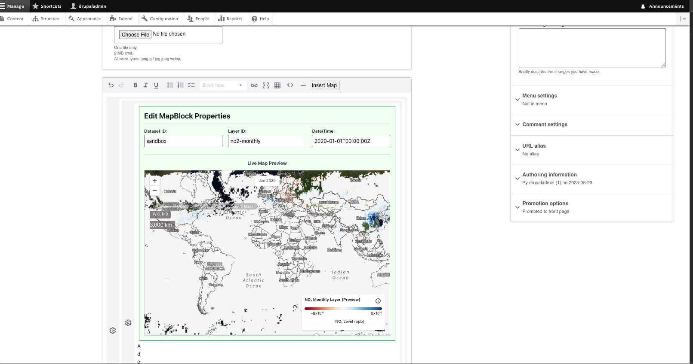

## Installation & Setup

1.  **Download/Clone the Module:**
    Place the `mdx_editor` module directory into your Drupal site's `modules/custom/` directory.

2.  **Install JavaScript Dependencies:**
    Navigate to the module's root directory in your terminal and install the necessary NPM packages:
    ```bash
    cd /path/to/your/drupal/root/modules/custom/mdx_editor
    yarn install
    # OR if you use npm:
    # npm install
    ```

3.  **Configure Environment Variables (API Keys & Endpoints):**
    This module uses environment variables for Mapbox tokens and API endpoints, which is recommended for keeping sensitive keys out of version control.
    * In the root of the `mdx_editor` module, create a file named `.env.local`.
    * Add your configuration to this file. **This file should NOT be committed to Git.**
        ```env
        # modules/custom/mdx_editor/.env.local

        MDX_EDITOR_MAPBOX_TOKEN="pk.your_actual_mapbox_token_here"
        MDX_EDITOR_API_STAC_ENDPOINT="https://your_stac_api_endpoint_here"
        MDX_EDITOR_API_RASTER_ENDPOINT="https://your_raster_api_endpoint_here"
        ```
    * Replace the placeholder values with your actual credentials.
    * **Important:** Ensure `.env.local` is listed in the module's `.gitignore` file.

4.  **Build JavaScript Assets:**
    After installing dependencies and setting up your `.env.local` file, build the JavaScript bundles:
    ```bash
    yarn run build
    ```
    This command will compile the React components and other JavaScript into distributable files located in the `js/dist/` directory within the module.

5.  **Enable the Module in Drupal:**
    * Navigate to the "Extend" page in your Drupal admin interface (`/admin/modules`).
    * Find "MDX Editor" (or the name specified in the `.info.yml` file) under the "Custom" package.
    * Check the box next to it and click "Install".

6.  **Clear Drupal Caches:**
    It's always a good practice to clear Drupal's caches after enabling new modules.
    * Using Drush: `drush cr`
    * Or via the Drupal Admin UI: `Configuration > Performance > Clear all caches`.

## Usage

1.  **Add MDX Field to Content Type:**
    * Navigate to `Structure > Content types` in your Drupal admin.
    * Choose a content type (e.g., "Article") and click "Manage fields".
    * Click "Add field". Select "MDX Content" (or the field type provided by this module) from the "Add a new field" dropdown.
    * Configure the field settings as needed.
    * On the "Manage form display" tab, ensure the "MDX Editor" widget is selected for your new field.
    * On the "Manage display" tab, ensure the "MDX Renderer" formatter is selected.

2.  **Using the MDX Editor:**
    * When creating or editing content of the configured type, you will see the MDXEditor.
    * You can write standard Markdown and embed JSX components.
    * Use the toolbar to format text and insert elements.
    * **Insert Map Button:** The toolbar includes an "Insert Map" button (or similar). Clicking this will insert a pre-configured `<MapBlock>` snippet into the editor. You can then edit its attributes (`datasetId`, `layerId`, `dateTime`) directly in the MDX source or via the `GenericJsxEditor` UI if it's functioning correctly.

    **Example MDX Snippet for Map:**
    ```mdx
    <Block type='full'>
      <Figure>
        <Widget heading='My Map Title'>
          <MapBlock
            datasetId='sandbox'
            layerId='no2-monthly'
            dateTime='2020-01-01T00:00:00Z'
          />
          <Caption attrAuthor="Source" attrUrl="[http://example.com](http://example.com)">
            A caption for the map.
          </Caption>
        </Widget>
      </Figure>
      <Prose>
        Some descriptive text about the map.
      </Prose>
    </Block>
    ```

    **Screenshots**
    
